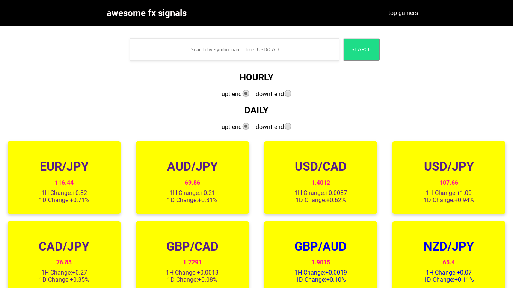
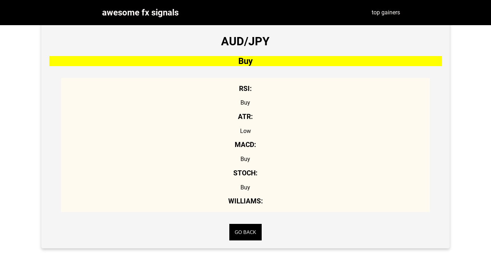
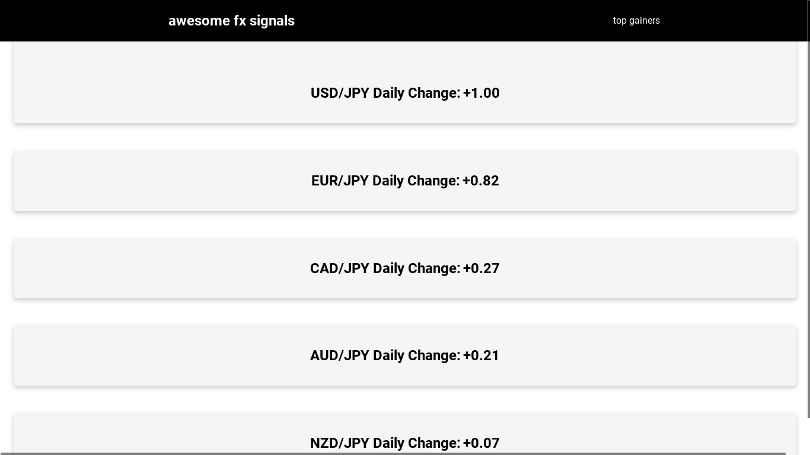

[![Contributors][contributors-shield]][contributors-url]

[![Forks][forks-shield]][forks-url]
[![Stargazers][stars-shield]][stars-url]

[![Issues][issues-shield]][issues-url]
[![MIT License][license-shield]][license-url]

# Awesome Forex Signals
 

  

  <h3 align="center">
    A Capstone project from the  Microverse React-Redux Curriculum
  </h3>

  <h3 align="center">
	 Live Version link - https://optimistic-goodall-b1eb96.netlify.app/
  </h3>

 

  

## Project 'Awesome Forex Signals'

This apps allows you to see the lastest prices of some forex pairs. You can filter them by uptrend and downtrend, daily and hourly. You can mix both options and get more specific options. So if you have a symbol that is performing positive daily and also hourly, you can catch that movement easily with filters.

You can also get more information of a symbol by clicking on it, or by searching by name, and with so you get a detailed technical analysis of that pair and also a final summary if its okay or not to buy or sell.

For API calls this project is using [FCSAPI](www.fcsapi.com)

## Design

This project was built using React and Redux for state managment. And also it uses with cautious some calls an external API. As the API limit is only 3 calls per minutes I had to optimize the app for that.

The first time you go to the mainpage, the app perfoms one API call to get all the prices for a specific and predefined lists of symbols. It stores them in the Redux store for later use.

You can use filters to get a filtered rendering of symbols, if they are uptrending or not, for example. This only perfoms Redux actions and it doesnt call the API. 

You can also enter manually the symbol you want to get, and if you enter valid symbol you also get a detailed information of that symbol. 

You get a list of the technical analysis and also a summary for buying or selling.

Lastly, you can also filter all the symbols by 'top gainers', these are the ones that got more positive daily variation. The big winners!

# Validations

-ESLINT

# Get Started

Download or clone this [repo here](https://github.com/alexawesomecode/awesome-fx-signals), enter the main folder and do `npm install` followed by `npm start`. 

The you go to http://localhost:3000

# Built With

This project was built with these techologies:

* React + Redux
* Javascript
* ES6
* Lodash
* Webpack & Babel
* HTML
* CSS3

# Authors

**Alejandro Andres**

- Github: [@alexawesomecode](https://github.com/alexawesomecode)
- Twitter: [@alexcode0](https://twitter.com/alexcode0)
- Linkedin: [Alejandro Andres](https://www.linkedin.com/in/alejandro-andres-126592191/)

# License

This project is licensed under the MIT License - see the [LICENSE.md](LICENSE.md) file for details

<!-- ACKNOWLEDGEMENTS -->
## Acknowledgements
* [Microverse](https://www.microverse.org/)
* [The Odin Project](https://www.theodinproject.com/)
* [FCSAPI](https://www.fcsapi.com/)

<!-- MARKDOWN LINKS & IMAGES -->
<!-- https://www.markdownguide.org/basic-syntax/#reference-style-links -->
[contributors-shield]: https://img.shields.io/github/contributors/alexawesomecode/awesome-fx-signals.svg?style=flat-square
[contributors-url]: https://github.com/alexawesomecode/awesome-fx-signals/graphs/contributors
[forks-shield]: https://img.shields.io/github/forks/alexawesomecode/awesome-fx-signals
[forks-url]: https://github.com/alexawesomecode/awesome-fx-signals/network/members
[stars-shield]: https://img.shields.io/github/stars/alexawesomecode/awesome-fx-signals
[stars-url]: https://github.com/alexawesomecode/awesome-fx-signals/stargazers
[issues-shield]: https://img.shields.io/github/issues/alexawesomecode/awesome-fx-signals
[issues-url]: https://github.com/alexawesomecode/awesome-fx-signals/issues
[license-shield]: https://img.shields.io/github/license/alexawesomecode/awesome-fx-signals
[license-url]: https://github.com/alexawesomecode/awesome-fx-signals/blob/master/LICENSE.txt
